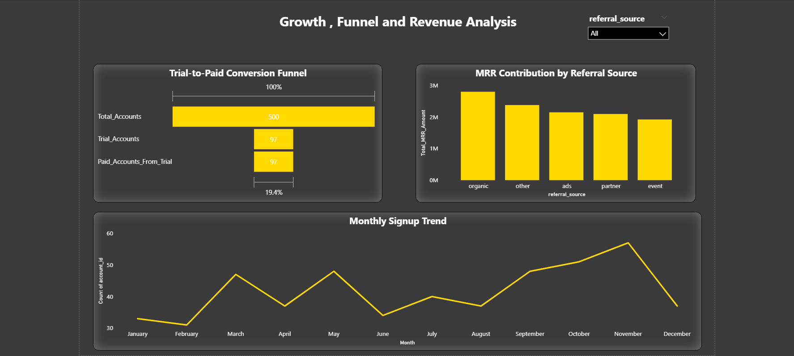
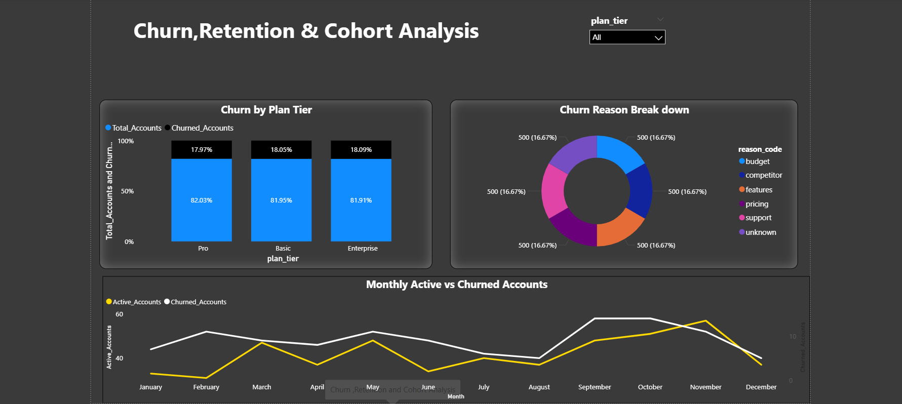

<div align="center">

  <!-- Gradient Banner -->
  

  <!-- Typing Subtitle -->
  <p>
    
  </p>

  <!-- Tech Stack Badges -->
  <div align="center">

  
  
  
  
  
  
  
  

  </div>

  <!-- Divider -->
  

</div>


This end-to-end SaaS analytics project delivers deep revenue and churn intelligence for **RavenStack** — a fictional AI-powered collaboration platform. Using real-world analytics workflows across Python, SQL, and Power BI, the project uncovers the behavioral, revenue, and support signals that drive customer churn, retention, and growth, enabling data-driven decisions across the full subscription lifecycle.

---

## 📌 Project Overview

Understanding SaaS subscription behavior, MRR trends, and churn drivers is critical for any product or growth team.  
This project analyzes RavenStack's customer base across 5 relational tables to uncover insights into:

- 📈 **Subscription growth** and monthly signup trends  
- 💰 **Revenue performance** by plan tier, industry, and country  
- 🔄 **Churn & retention behavior** — who churns, when, and why  
- 🧪 **Trial-to-paid conversion** funnel performance  
- 📦 **Feature adoption patterns** across the product suite  
- 👥 **Cohort analysis** — revenue and churn within 30/60/90 days  
- 🔁 **Downgrade & reactivation** tracking  

The insights from this project are directly applicable for:

- SaaS product and growth teams  
- Customer success and retention managers  
- Revenue operations and finance teams  
- Data analysts building SaaS dashboards  

---

## 📁 Repository Structure

```text
saas-subscription-revenue-churn-intelligence/
│
├── assets/
│   ├── SaaS_Revenue_Customer_Health_Overview.png
│   ├── Growth_Funnel_Revenue_Performance.png
│   ├── Churn_Retention_Cohort_Intelligence.png
│   └── project_visuals/                         # Dashboard previews, charts, and supporting visuals
│
├── data/
│   ├── ravenstack_accounts.csv                  # Customer profiles, signup details, industry, country, and churn status
│   ├── ravenstack_subscriptions.csv             # Subscription lifecycle, billing, MRR, ARR, upgrades, and downgrades
│   ├── ravenstack_feature_usage.csv             # Product engagement and feature adoption logs
│   ├── ravenstack_support_tickets.csv           # Support interactions, escalations, and satisfaction metrics
│   └── ravenstack_churn_events.csv              # Churn reasons, refunds, reactivations, and cancellation behaviour
│
├── notebook/
│   └── saas_revenue_churn_cohort_intelligence_analysis.ipynb
│       # End-to-end Python analysis covering SaaS growth, revenue, churn, cohort retention, and customer-risk insights
│
├── sql/
│   └── saas_revenue_churn_retention_sql_analysis.sql
│       # Advanced PostgreSQL analysis using CTEs, window functions, funnel logic, cohort metrics, and revenue intelligence queries
│
├── powerbi/
│   └── SaaS_Revenue_Churn_Intelligence_Dashboard.pbix
│       # Interactive 3-page Power BI dashboard for executive revenue, funnel, churn, and retention analysis
│
├── .gitignore                                   # Excludes temporary, local, and environment-specific files
├── LICENSE                                      # MIT License
└── README.md                                    # Full project documentation
```


---

## 🗄️ About the Dataset

The dataset is a **synthetic multi-table SaaS dataset** sourced from [Kaggle by River @ Rivalytics](https://www.kaggle.com/datasets/rivalytics/saas-subscription-and-churn-analytics-dataset), designed to closely mirror real-world SaaS data structures and support end-to-end analytics practice across 5 relational tables:

| Table | Records | Key Fields |
|-------|---------|------------|
| `accounts` | 500 | industry, country, plan_tier, signup_date, churn_flag |
| `subscriptions` | 5,000 | mrr_amount, arr_amount, billing_frequency, upgrade/downgrade flags |
| `feature_usage` | 25,000+ | feature_name, usage_count, usage_duration_secs, error_count |
| `churn_events` | 600 | churn_date, reason_code, refund_amount, is_reactivation |
| `support_tickets` | ~2,500 | resolution_time_hours, satisfaction_score, escalation_flag |

**Industries covered:** EdTech · FinTech · DevTools · HealthTech · Cybersecurity  
**Markets:** 7 countries represented  
**Plan Tiers:** Basic (168 accounts) · Pro (178 accounts) · Enterprise (154 accounts)  
**Overall Churn Rate:** 22% across all accounts  
**Total MRR in Dataset:** $11.3M+ across all subscription records  

---

## 🔍 Analysis Workflow

---

## 🐍 1. Data Cleaning & EDA (Python)

All data wrangling and exploratory analysis were performed in the Jupyter Notebook.

### ✔ Key Cleaning Steps

- Parsed and standardized all date columns across all 5 tables  
- Retained null `end_date` records as valid **active subscriptions** (not dropped)  
- Derived `subscription_status` column: `Active - Paid`, `Active - Free`, `Ended`  
- Preserved zero-MRR records representing free plans, trials, and delayed billing  
- Filled missing churn `feedback_text` with a structured fallback label  
- Added `feedback_status` column for support ticket quality tracking  
- Verified zero duplicate records across all five tables  

### ✔ Business Questions Solved in Python

| # | Business Question |
|---|-------------------|
| Q1 | Distribution of accounts across plan tiers |
| Q2 | Monthly account signup growth trends |
| Q3 | Trial vs. non-trial account breakdown |
| Q4 | MRR distribution across active subscriptions |
| Q5 | Most frequently used product features |
| Q6 | Feature usage intensity variation across features |
| Q7 | Session duration distribution by feature |

---

## 🗄️ 2. SQL Business Analysis (PostgreSQL / pgAdmin 4)

Advanced SQL queries using CTEs and window functions were executed in **pgAdmin 4** to answer strategic business questions across revenue, churn, and customer lifecycle.

### 🔍 Key Business Questions Solved

---

### 💰 Revenue Intelligence

#### MRR & ARR by Plan Tier
- Calculates total and average MRR per plan tier  
- Reveals which plan tier drives the most predictable recurring revenue

#### Industry Revenue Contribution
- Identifies top revenue-generating industries across the customer base  
- Ranks FinTech, EdTech, DevTools, HealthTech, and Cybersecurity by total MRR

#### Top 5 Countries by Revenue + Seat Count
- Ranks markets by total revenue alongside average team size  
- Guides geographic expansion and pricing strategy

#### Referral Source Revenue Comparison
- Compares total and average MRR by customer acquisition channel  
- Quantifies organic vs. paid vs. partner ROI

---

### 📉 Churn & Retention Intelligence

#### Churn Rate by Plan Tier
- Calculates churned account percentage per plan tier  
- Reveals which tier retains customers least effectively

#### Downgrade-to-Churn Pipeline
- Quantifies what % of churned accounts had a preceding downgrade event  
- Calculates total MRR lost from accounts that downgraded before churning

#### Reactivation Performance
- Counts reactivated accounts and their average MRR post win-back  
- Measures the effectiveness of re-engagement programs

---

### 👥 Cohort & Lifecycle Analysis

#### Trial-to-Paid Conversion Funnel
- Computes total trial accounts, paid conversions, and conversion rate  
- Uses CTEs to model the full acquisition funnel in SQL

#### Monthly Signup Cohorts with Early Churn Windows
- Groups accounts by signup month (cohort)  
- Tracks churn events within 30, 60, and 90 days per cohort class

#### First-3-Month Revenue by Cohort
- Calculates average MRR per account in the first 90 days post-signup  
- Reveals early monetization efficiency by cohort vintage

#### Month-over-Month Active Account Tracking
- Uses `generate_series` to build a continuous calendar spine  
- Counts distinct active accounts per month based on subscription start/end dates

---

### 🧾 Sample SQL Query — Trial-to-Paid Conversion Funnel

```sql
WITH trial_accounts AS (
    SELECT account_id
    FROM accounts
    WHERE is_trial = TRUE
),
paid_conversions AS (
    SELECT DISTINCT t.account_id
    FROM trial_accounts t
    JOIN subscriptions s
        ON t.account_id = s.account_id
    WHERE s.mrr_amount > 0
)
SELECT
    COUNT(DISTINCT t.account_id) AS total_trial_accounts,
    COUNT(DISTINCT p.account_id) AS converted_paid_accounts,
    ROUND(
        COUNT(DISTINCT p.account_id)::NUMERIC
        / COUNT(DISTINCT t.account_id) * 100,
        2
    ) AS conversion_rate_percentage
FROM trial_accounts t
LEFT JOIN paid_conversions p
    ON t.account_id = p.account_id;
```

---

# 📊 3. Power BI Dashboard

The cleaned and analyzed dataset was loaded into Power BI to build a three-page interactive SaaS intelligence dashboard suitable for executive and operational audiences.

<div align="center">

  <p>
    <a href="https://www.novypro.com/project/" target="_blank">
      🚀 View Live Dashboard
    </a>
  </p>

</div>


---

### 🏢 Page 1 — Executive Overview


<div align="center">


</div>

&nbsp; &nbsp;

#### 🔍 Key Insights & Business Takeaways

- Total Accounts, Active MRR, Churn Rate, and ARR KPI cards  
- Revenue breakdown by plan tier and industry vertical  
- Country-level revenue distribution  
- Referral source performance summary  


---

### 📈 Page 2 — Growth & Funnel Analysis


<div align="center">



</div>

&nbsp; &nbsp;

#### 🔍 Key Insights & Business Takeaways

- Monthly signup trend with growth rate annotations  
- Trial vs. paid account composition donut chart  
- Trial-to-paid conversion funnel visualization  
- Active account count month-over-month trend  

---

### 🔄 Page 3 — Churn, Retention & Cohort Analysis


<div align="center">



</div>

&nbsp; &nbsp;

#### 🔍 Key Insights & Business Takeaways

- Monthly churn trend and churn reason category breakdown
- Downgrade-before-churn MRR loss impact visualization
- Cohort retention heatmap (30 / 60 / 90-day windows)
- Reactivated account MRR recovery tracking


---
## 📈 Key Findings & Insights

### 🏆 Revenue
- **Enterprise** accounts generate the highest average MRR despite smaller account volume  
- **FinTech and DevTools** industries contribute disproportionately to total platform revenue  
- Top 5 countries account for ~70% of all MRR — geographic concentration is a revenue risk

### 📉 Churn
- **22% overall churn rate** across the 500-account customer base  
- Top churn reasons: `features` (missing product functionality) > `support` quality > `budget` constraints  
- Accounts that **downgrade before churning** signal an identifiable, preventable revenue loss window  
- A meaningful segment of churned accounts was later **reactivated**, validating win-back investment

### 👥 Cohort & Retention
- Early churn (within 30 days) is elevated in newer cohorts — onboarding experience is a primary risk zone  
- Trial accounts convert at varying rates by cohort month — engagement timing materially affects conversion  
- First-3-month MRR per cohort varies significantly, indicating inconsistent early value delivery across vintages

### 💡 Feature Adoption
- A small core set of features drives the majority of all product usage  
- Beta features show elevated error counts — product quality risk before general availability  
- Session duration varies widely across features — some drive deep engagement, others face rapid abandonment

---

## 💼 5. Business Recommendations

Based on the full analysis, RavenStack could drive measurable improvements in retention and revenue by:

1. **🎯 Prioritize Enterprise retention programs** — highest MRR per account, highest revenue loss if churned  
2. **🚨 Trigger early lifecycle intervention** — low feature usage in the first 30 days is a leading churn signal  
3. **🔁 Build a downgrade early-warning system** — downgrade events reliably precede full churn  
4. **💬 Address `features` as the #1 churn reason** — product gaps are the top driver of departure  
5. **📣 Invest in structured win-back campaigns** — reactivation data proves re-engagement works  
6. **🌍 Diversify geographic revenue concentration** — reduce dependency on top-5 markets  

---

## 🧩 Tools & Technologies

| Category | Technology |
|----------|------------|
| **Data Wrangling** | Python, Pandas, NumPy |
| **Visualization** | Matplotlib, Seaborn |
| **Notebook Environment** | Jupyter Notebook |
| **Database** | PostgreSQL (pgAdmin 4) |
| **SQL Techniques** | CTEs, Window Functions, Aggregations, generate_series |
| **BI Dashboard** | Microsoft Power BI |
| **Version Control** | GitHub |

---

## 📋 Prerequisites

- **Python 3.8+** with `pandas`, `numpy`, `matplotlib`, `seaborn`  
- **PostgreSQL 13+** and pgAdmin 4  
- **Power BI Desktop**  
- **Jupyter Notebook**  

---

## 🛠️ Installation & Setup

### 1. Clone the Repository

```bash
git clone https://github.com/dineshbarri/saas-subscription-revenue-churn-intelligence.git
cd saas-subscription-revenue-churn-intelligence
```

---

### 2. Set Up Python Environment

```bash
python -m venv venv && source venv/bin/activate   # Windows: venv\Scripts\activate
pip install pandas numpy matplotlib seaborn jupyter
```

---

### 3. Install dependencies

```bash
pip install pandas numpy matplotlib seaborn sqlalchemy jupyter
```

---

### 4. Run the Jupyter notebook

```bash
jupyter notebook notebook/saas_revenue_churn_cohort_intelligence_analysis.ipynb
```
> 💡 Update the `file_path` variable in the Setup cell to point to your local `data/` directory before running all cells.
---

### 5. Load Data into PostgreSQL (pgAdmin 4)

- Open **pgAdmin 4** and create a new database named `saas_analysis`  
- Import each CSV via **Right-click on Tables → Import/Export Data** for each of the 5 tables  
- Open `sql/saas_revenue_churn_retention_sql_analysis.sql`  
- Select the `saas_analysis` database and run the script (F5)  

---

### 6. Open the Power BI Dashboard

- Install [Power BI Desktop](https://powerbi.microsoft.com/desktop/) if not already installed  
- Open `PowerBi/SaaS Revenue & Churn_Intelligence_Dashboard.pbix`  
- If prompted to refresh data source, point the file path to your local `data/` folder  


---

### 📊 Dataset Source

📎 [RavenStack SaaS Dataset on Kaggle](https://www.kaggle.com/datasets/rivalytics/saas-subscription-and-churn-analytics-dataset) — by River @ Rivalytics

---


### 📈 Business Impact

This project demonstrates how raw SaaS data can be transformed into strategic intelligence:

- **Revenue Intelligence** — identify MRR concentration, risk segments, and growth levers  
- **Churn Early Warning** — behavioral and support signals that precede cancellation  
- **Retention Frameworks** — cohort-based strategies to reduce early and late-stage churn  
- **Product Prioritization** — feature adoption data to align roadmap with usage reality  
- **Executive Dashboards** — shareable Power BI reports ready for leadership communication  

---

### 🔮 Future Enhancements

- Machine learning churn prediction model (Logistic Regression / XGBoost / LightGBM)  
- SHAP-based model interpretability for churn feature importance  
- NLP analysis of `feedback_text` churn responses for unstructured signal extraction  
- Customer health score model combining usage, support, and billing signals  
- Real-time Power BI dashboard with live database refresh  

---

### 🤝 Contributing

Contributions, issues, and feature requests are welcome.  
Feel free to open a pull request or create an issue to suggest improvements.

---

### 💖 Support This Project

If you find this useful, consider supporting my open-source work in Data Analytics, ML & AI automation.  
👉 [GitHub Sponsors](https://github.com/sponsors/dineshbarri) | [PayPal](https://paypal.me/dineshbarri1997)

---

## 👨‍💻 Creator

### Dinesh Barri

#### 📬 Contact Information

- **📧 Email**: [dineshbarri1997@gmail.com](mailto:dineshbarri1997@gmail.com)
- [](https://github.com/dineshbarri)
- [](https://www.linkedin.com/in/dinesh-barri-7654b010b)

---

## 📄 License

[](https://opensource.org/licenses/MIT)

This project is licensed under the **MIT License** — see the [LICENSE](LICENSE) file for details.

---

### ⭐ If you like this project, don't forget to give it a star!
